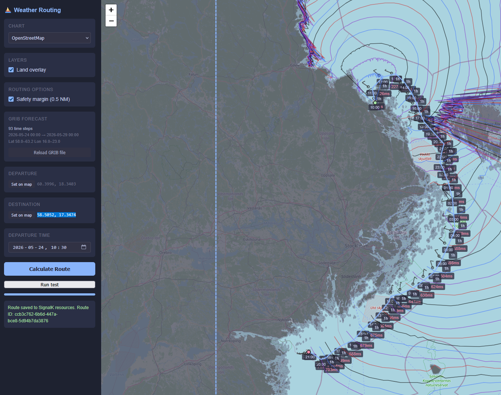

# signalk-weather-routing

**Experimental.** This plugin has not been validated by sailing the calculated routes. It is also significantly rough around the edges in terms of user experience. Improvement proposals and bug reports are welcome.

A SignalK plugin that calculates time-optimal sailing routes using GRIB2 weather forecasts and the isochrone method.

## Features

- Isochrone routing optimised for time-to-destination
- Wind data from GRIB2 files (tested with [OpenSkiron](https://openskiron.org/) ICON-EU, 7 km grid)
- Polar diagrams in ORC/OpenCPN semicolon-delimited CSV format
- Automatic land avoidance using [GSHHG](https://www.soest.hawaii.edu/pwessel/gshhg/) high-resolution coastlines
- Optional 0.5 NM safety margin that closes narrow passages below the algorithm's resolution
- Routes saved to SignalK `resources/routes` — visible in freeboard-sk automatically
- Leaflet-based webapp with live isochrone rendering during calculation
- Runs on Raspberry Pi 3–5



## Requirements

- SignalK server (Node.js)
- A GRIB2 weather forecast file (e.g. from [OpenSkiron](https://openskiron.org/))
- A polar diagram file in ORC/OpenCPN CSV format

## Installation

Install via the SignalK app store, or manually:

```bash
cd ~/.signalk
npm install signalk-weather-routing
```

Restart SignalK. On first start the plugin downloads and extracts the GSHHG coastline data (~170 MB) automatically.

## Configuration

In the SignalK admin UI under **Server → Plugin Config → Weather Routing**:

| Setting | Description |
|---|---|
| `gribPath` | Full path to the GRIB2 forecast file |
| `polarPath` | Full path to the polar diagram CSV file |

## Usage

Open the webapp at `http://<your-signalk-host>:3000/signalk-weather-routing/`.

1. Set a departure point and destination on the map (or use **Run test** for a pre-filled example)
2. Set a departure time
3. Optionally enable **Safety margin** to close narrow passages near the route
4. Click **Calculate Route**

Isochrones are drawn live as the calculation progresses. The finished route is saved to SignalK resources and displayed with wind barbs and ETA at each waypoint.

The **Land overlay** checkbox shows the GSHHG coastline used for routing. When the safety margin is enabled, the dilated (merged) polygons appear in light gray beneath the original coastline.

## Polar diagram format

Standard ORC/OpenCPN semicolon-delimited CSV. First row is a header with TWS values; subsequent rows start with a TWA value followed by boat speeds:

```
twa/tws;6;8;10;12;14;16;20
52;4.5;5.2;5.8;6.1;6.3;6.4;6.5
...
```

## Notes

- GRIB files are not downloaded automatically — obtain them from [OpenSkiron](https://openskiron.org/) or another provider and point the plugin at the file path
- Routing accuracy depends on polar quality and forecast accuracy
- The algorithm cannot thread passages narrower than approximately 1 NM at typical leg lengths
