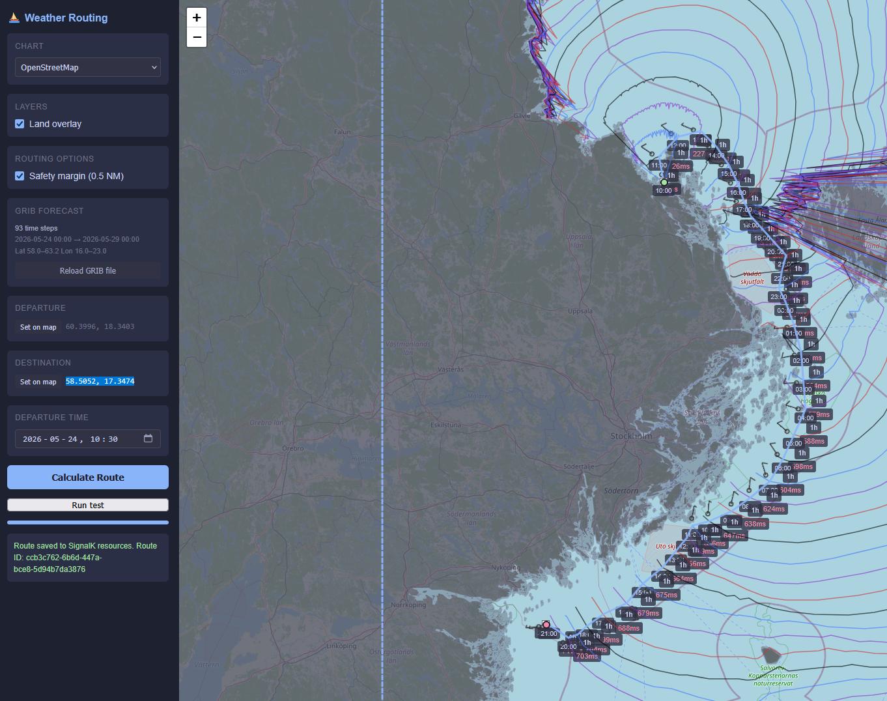

# signalk-weather-routing

**Experimental.** This plugin has not been validated by sailing the calculated routes. It is also significantly rough around the edges in terms of user experience. Improvement proposals and bug reports are welcome.

A SignalK plugin that calculates time-optimal sailing routes using GRIB2 weather forecasts and the isochrone method.

## Features

- Isochrone routing optimised for time-to-destination
- Wind data from GRIB2 files (tested with [OpenSkiron](https://openskiron.org/en/icon-gribs) ICON-EU, 7 km grid)
- Polar diagrams in ORC/OpenCPN semicolon-delimited CSV format
- Automatic land avoidance using [GSHHG](https://www.soest.hawaii.edu/pwessel/gshhg/) high-resolution coastlines
- Optional 0.5 NM safety margin that closes narrow passages below the algorithm's resolution
- Optional max wind speed and max wave height routing constraints
- Departure point can be set from any existing SignalK route (last waypoint) or waypoint via a dropdown
- Routes saved to SignalK `resources/routes` — visible in freeboard-sk automatically
- Leaflet-based webapp with live isochrone rendering during calculation
- Runs on Raspberry Pi 3–5



## Requirements

- SignalK server (Node.js)
- A GRIB2 weather forecast file (e.g. from [OpenSkiron](https://openskiron.org/en/icon-gribs))
- A polar diagram file in ORC/OpenCPN CSV format

## Installation

See [DEVELOPMENT.md](DEVELOPMENT.md) for build and install instructions.

The land index is bundled with the package — no download is needed at install or runtime.

## Configuration

In the SignalK admin UI under **Server → Plugin Config → Weather Routing**:

| Setting | Description |
|---|---|
| `gribDir` | Full path to the directory containing GRIB2 forecast files |
| `polarPath` | Full path to the polar diagram CSV file |
| `hideTestButtons` | When enabled, hides the Run test / Helsinki test / Gothenburg test buttons in the webapp (default: true) |

## Usage

Open the webapp at `http://<your-signalk-host>:3000/signalk-weather-routing/`.

1. Set a departure point and destination on the map (or pick an existing route or waypoint from the **— set from resources —** dropdown beneath the start field — for routes, the last waypoint is used), or use **Run test** for a pre-filled example
2. Set a departure time
3. Optionally enable **Safety margin** to close narrow passages near the route
4. Optionally set **Max wind** and/or **Max wave** routing constraints (see below)
5. Click **Calculate Route**

Isochrones are drawn live as the calculation progresses. The finished route is saved to SignalK resources and displayed with wind barbs and ETA at each waypoint.

The **Land overlay** checkbox shows the GSHHG coastline used for routing. When the safety margin is enabled, the dilated (merged) polygons appear in light gray beneath the original coastline.

Click the conditions graph at the bottom to expand it to fullscreen. Click again or press Escape to return to normal.

## Routing constraints

The **Max wind** and **Max wave** fields in the Routing Options panel let you restrict the route to areas where conditions are within your limits.

**Max wind (knots):** Any candidate position where the forecasted wind speed exceeds this value is discarded — the router will not route through that area regardless of the time savings. Leave empty for no limit.

**Max wave (metres):** Any candidate position where the significant wave height exceeds this value is discarded. Only applied when wave data (SWH bands) is present in the loaded GRIB file — OpenSkiron ICON-EU EWAM files include both wind and wave bands. Leave empty for no limit.

Both constraints are independent. Setting max wind to 20 kn and leaving max wave empty means only wind is constrained.

## Polar diagram format

Standard ORC/OpenCPN semicolon-delimited CSV. First row is a header with TWS values; subsequent rows start with a TWA value followed by boat speeds:

```
twa/tws;6;8;10;12;14;16;20
52;4.5;5.2;5.8;6.1;6.3;6.4;6.5
...
```

**Wind speed limits:** The router treats the polar's highest TWS column as a hard cap. Any forecast wind above that value is evaluated at the maximum column speed — the router does not extrapolate beyond measured data. For a polar whose highest column is 20 kn, a 30 kn forecast cell gives the same boat speed as a 20 kn cell. This prevents the router from preferring high-wind areas because of artificially inflated speed predictions.

**Minimum TWA:** The polar's lowest TWA row is the tacking angle. The router returns zero speed for any heading tighter than this — the boat cannot sail into the wind.

## Land data (GSHHG)

Land avoidance is powered by the [GSHHG](https://www.soest.hawaii.edu/pwessel/gshhg/)
(Global Self-consistent Hierarchical High-resolution Geography) dataset, version 2.3.7,
published by NOAA and the University of Hawaii. GSHHG is distributed under the
[GNU Lesser General Public License v3](https://www.gnu.org/licenses/lgpl-3.0.html).

Download page: https://www.soest.hawaii.edu/pwessel/gshhg/

The plugin bundles pre-built binary indices derived from the GSHHG `h` (high, ~7 km)
resolution tier. If you need to regenerate the indices (e.g. to change resolution),
see [DEVELOPMENT.md](DEVELOPMENT.md).

## Notes

- GRIB files are not downloaded automatically — obtain them from [OpenSkiron](https://openskiron.org/en/icon-gribs) or another provider and point the plugin at the file path
- Routing accuracy depends on polar quality and forecast accuracy
- The algorithm cannot thread passages narrower than approximately 1 NM at typical leg lengths
